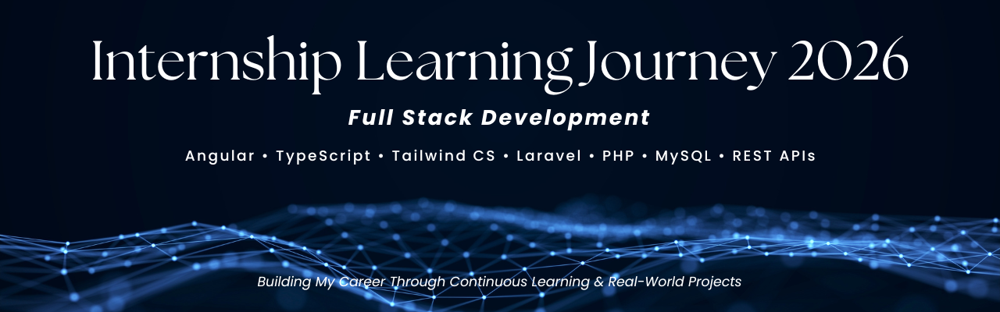

<p align="center">
  
</p>

# Internship Learning Journey 2026

---

## About

This repository documents my 6-month Full Stack Development Internship journey.

Throughout this internship, I am learning modern frontend and backend technologies while building practical applications, strengthening my programming skills, and documenting my weekly progress through projects, learning notes, and technical documentation.

---

## Repository Structure

```
Internship-Learning-Journey-2026/
│
├── Assets/
│   ├── Banner/
│   └── Screenshots/
│
├── Learning-Notes/
│
├── Projects/
│   ├── Week-01/
│   └── Week-02/
│
├── Weekly-Progress/
│   ├── Week-01.md
│   └── Week-02.md
│
└── README.md
```

---

## Quick Navigation

### Repository Sections

- 📂 [Projects](./Projects)
- 📂 [Weekly Progress](./Weekly-Progress)
- 📂 [Learning Notes](./Learning-Notes)
- 📂 [Screenshots](./Assets/Screenshots)

---

## Weekly Progress

- 📘 [Week 01 Progress Report](./Weekly-Progress/Week-01.md)
- 📘 [Week 02 Progress Report](./Weekly-Progress/Week-02.md)

---

## Projects

### Week 01

- Task 01 – Profile Card
- Task 02 – Student Registration Form
- Task 03 – Student CRUD System
- Task 04 – Student CRUD Enhanced
- Task 05 – User Directory
- Task 06 – Weather Dashboard

### Week 02

- Task 08 – SQL Database Basics
- Task 09 – SQL Database Operations
- Task 10 – SQL JOIN Operations

---

## Learning Notes

- 📖 HTML, CSS & JavaScript
- 📖 MySQL Database
- 📖 PHP Fundamentals

---

## Technologies Covered

### Frontend

- HTML5
- CSS3
- JavaScript (ES6)

### Backend

- PHP
- MySQL
- XAMPP
- phpMyAdmin

### Currently Learning

- Angular 20
- TypeScript
- Tailwind CSS
- RxJS
- Laravel 12
- REST API Development

---

## Learning Roadmap

| Month | Focus Area |
|---------|------------|
| Month 1 | HTML, CSS, JavaScript, SQL & PHP Fundamentals |
| Month 2 | Angular Development |
| Month 3 | API Integration |
| Month 4 | Laravel Backend |
| Month 5 | Authentication & Authorization |
| Month 6 | Full Stack Project Development |

---

## Internship Progress

| Week | Status | Topics Covered |
|------|---------|----------------|
| Week 01 | ✅ Completed | HTML, CSS, JavaScript, CRUD Operations, Local Storage, REST APIs |
| Week 02 | ✅ Completed | DBMS, RDBMS, SQL, MySQL, SQL Queries, Joins, PHP Fundamentals |
| Week 03 | 🔄 In Progress | PHP + MySQL Database Connectivity & CRUD |
| Week 04 | ⏳ Upcoming | Laravel Fundamentals |

---

## Skills Gained

### Frontend Development

- HTML5
- CSS3
- JavaScript
- Responsive Web Design
- DOM Manipulation
- Form Validation
- Local Storage
- REST API Integration

### Database

- DBMS & RDBMS
- SQL
- MySQL
- CRUD Operations
- Primary & Foreign Keys
- SQL JOINs
- Aggregate Functions

### Backend Fundamentals

- PHP Basics
- Variables & Data Types
- Operators
- Control Statements
- Loops
- Functions
- Arrays
- Superglobals

---

## Goals

- Build strong frontend development skills.
- Strengthen database design and SQL knowledge.
- Master PHP fundamentals before moving to Laravel.
- Learn Angular ecosystem.
- Develop REST APIs using Laravel.
- Build real-world Full Stack applications.
- Become industry-ready as a Full Stack Developer.

---

## Connect With Me

### LinkedIn

https://www.linkedin.com/in/jeesonjustin

### GitHub

https://github.com/jeesonjustin
