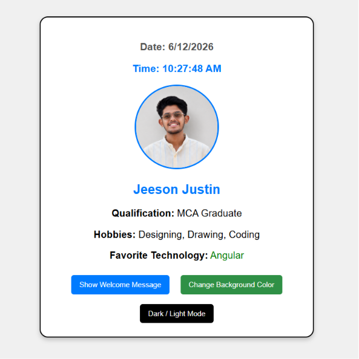
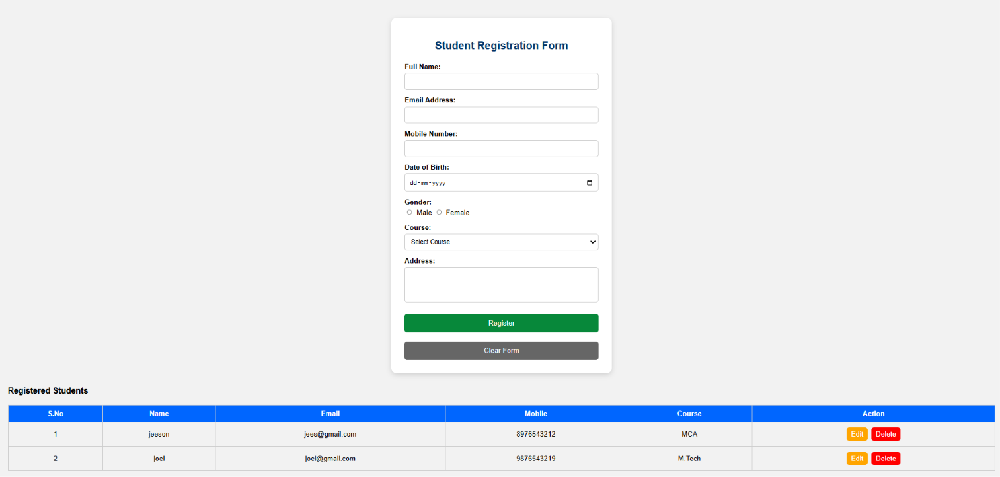
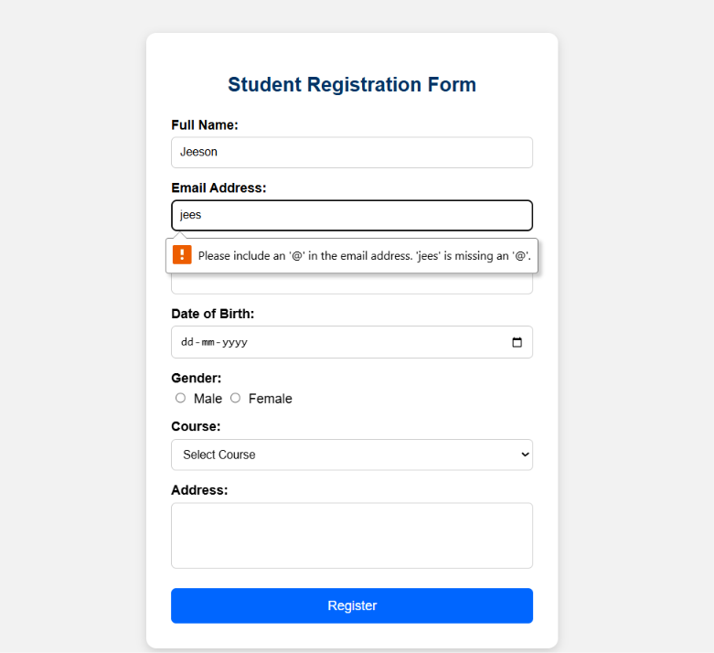
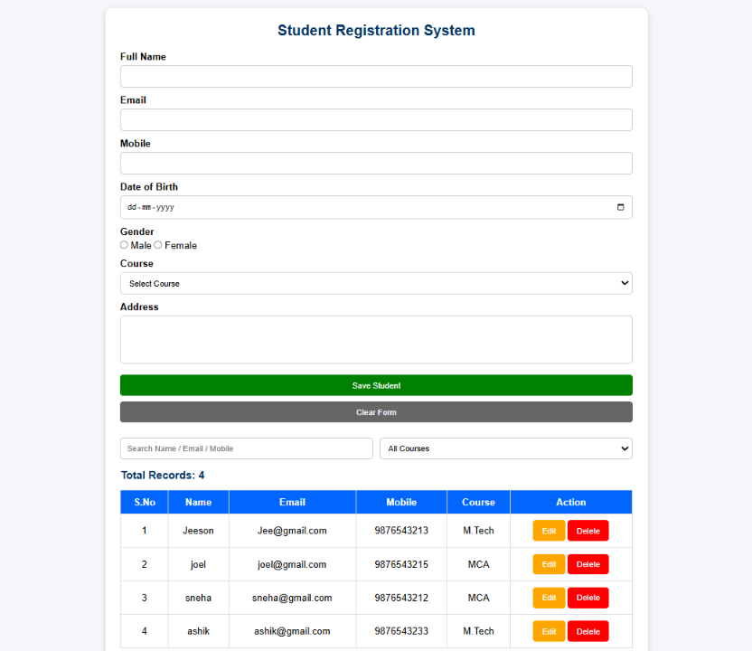
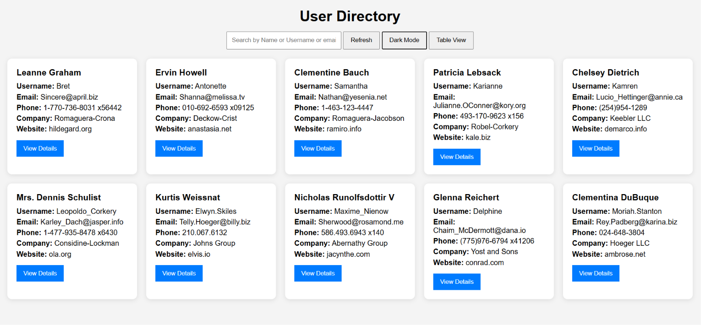
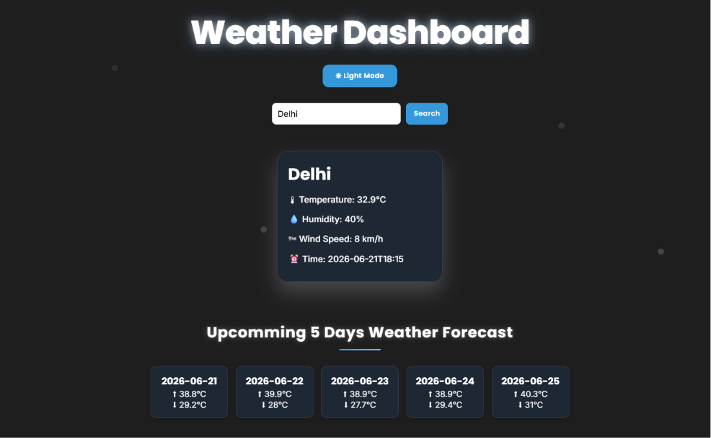

# Week 01

## Overview

Completed the first week of my Full Stack Development Internship by strengthening frontend development fundamentals and building interactive web applications using HTML, CSS, JavaScript, Local Storage, and REST APIs.

---

## Technologies Covered

- HTML5
- CSS3
- JavaScript (ES6)
- DOM Manipulation
- Form Validation
- Local Storage
- Fetch API
- REST API Integration
- Responsive Design

---

## Tasks Completed

### Day 1 – Profile Card Application

Built a personal profile card application featuring:

- User profile information
- Dynamic welcome message
- Background color changer
- Dark/Light mode toggle
- Digital clock and date-time display

### Day 2 – Student Registration Form

Developed a student registration form with:

- Multiple input fields
- Form validation
- User-friendly interface
- Structured form design

### Day 3 – Student Registration CRUD System

Enhanced the registration form by implementing:

- Create, Read, Update, Delete (CRUD) operations
- Dynamic table rendering
- Edit and delete functionality
- Success notifications

### Day 4 – Student Registration System Enhancement

Improved the CRUD application with:

- Local Storage data persistence
- Search functionality
- Course-based filtering
- Record counter
- Delete and update confirmations
- Responsive UI improvements

### Day 5 – User Directory Application

Built a user directory using a public REST API:

- Fetched user data using Fetch API
- Dynamic user cards
- Search functionality
- User detail view
- Error handling
- Dark/Light mode support

### Day 6 – Weather Dashboard

Developed a weather dashboard using Open-Meteo API:

- City-based weather search
- Real-time weather information
- Search history using Local Storage
- 5-day forecast display
- Error handling
- Responsive design
- Dark/Light theme support

---

## Key Concepts Learned

- HTML page structure
- CSS styling techniques
- JavaScript fundamentals
- DOM manipulation
- Event handling
- Form validation
- CRUD operations
- Local Storage management
- API consumption using Fetch API
- Asynchronous JavaScript
- Responsive web design
- Error handling strategies

---

## Challenges Faced

- Understanding CRUD logic and data flow
- Working with Local Storage
- Integrating external APIs
- Managing dynamic UI updates
- Handling asynchronous API requests

---

## Outcome

Successfully completed all Week 01 tasks and gained practical experience in frontend development fundamentals, API integration, and interactive web application development.

---

## Screenshots

### Day 1 – Profile Card Application

### Day 2 – Student Registration Form

### Day 3 – CRUD System

### Day 4 – CRUD Enhancement

### Day 5 – User Directory

### Day 6 – Weather Dashboard

